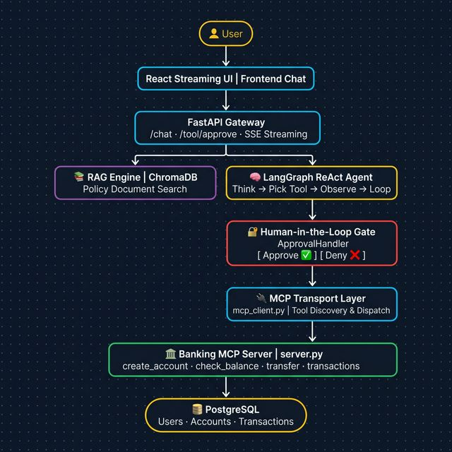

# AI Banking Assistant 🏦🚀

> A **Next-Gen Autonomous AI Banker** with **Model Context Protocol (MCP)** integration, featuring RAG (Retrieval-Augmented Generation), LangGraph ReAct orchestration, intelligent tool selection, and human-in-the-loop approval for sensitive financial operations.



---
## 📖 Documentation Hub

To understand how this system works, start here:

### 1. `README.md` (You are here)
- **Purpose**: Quickstart & setup.
- **Bonus**: At the bottom of this file, you will find the complete **Live Demo Educator's Script**, featuring step-by-step presentation mechanics.

### 2. [System Architecture & Flow Design](./system_architecture.md)
- **Purpose**: High-level design, database structures, and theoretical flows.
- **Includes**: 
  - Mermaid UI Architecture Flowcharts
  - Technical execution path scenarios (Tool Filtering, Context Routing, Approval Gate).
  - PostgreSQL & ChromaDB setup rules.

### 3. [Code Execution Trace & Deep Dive](./code_execution_trace.md)
- **Purpose**: Developer-level code tracing.
- **Includes**:
  - The massive Step-by-Step Back-End Walkthrough linking directly to source line numbers.
  - The brutal line-by-line breakdown of the `api/main.py:chat()` function logic.

---

## 💬 What You Can Do (Demo Walkthrough)

| Step | You Say | What Happens |
| :---: | :--- | :--- |
| 1 | *"What can you do?"* | LLM smart-filters out all tools → answers using base system prompt text |
| 2 | *"Write a poem"* | Agent enforces scope boundaries and politely declines non-finance requests |
| 3 | *"Show balance for john123"* → wrong creds | Agent slot-fills password → MCP DB lookup fails → agent formats clean error |
| 4 | *"Create account john123, pass456, $500"* | Approval card shown → human clicks Approve → account created in PostgreSQL |
| 5 | *"What's my balance for john123?"* | Full path: slot-fills password → executes MCP call → streams formatted markdown |

---

## 🛠️ Technology Stack

### Core AI Engine
- **LangGraph** (`langgraph.prebuilt.create_react_agent`): Orchestrates the ReAct loop — think → tool call → observe → repeat.
- **LangChain**: Provides `ChatPromptTemplate`, `MessagesPlaceholder`, `StructuredTool`, and chain primitives used by `agent_engine.py`.
- **MCP (Model Context Protocol)**: All banking operations are MCP tools discovered dynamically at runtime via `mcp_client.py`.
- **RAG (Retrieval-Augmented Generation)**: ChromaDB + Cohere Rerank for answering policy/FAQ questions from uploaded documents.

### Unified Agent Architecture (in `agent_engine.py`)
- We dropped complex if/else routing in favor of a **single unified `create_react_agent`** loop.
- The system uses a rapid LLM lookup (`select_relevant_tools`) to decide which MCP tools are dynamically provided to the agent before it boots up. This drastically cuts token costs and latency for simple introductory chat or fallback scenarios while maintaining one robust execution path for all transactions.

### MCP Client (`mcp_client.py`)
- **Persistent sessions** via `asyncio.Task` + `asyncio.Event` for each server.
- **Per-server locking** (`asyncio.Lock`) prevents connection race conditions.
- **Tool caching** (5-minute TTL) avoids redundant `list_tools` calls.
- **OAuth / Auth-URL detection** via `auth_aware_stdio_client` — captures stderr to intercept auth redirects.
- **`schema_adapter`**: Config-driven JSON Schema patching and server-native argument reconstruction (replaces hard-coded schema hacks).
- **Approval gate**: Tools with destructive keywords (`create`, `delete`, `update`, `send`, etc.) raise `ApprovalRequiredException` before execution.

### Backend
- **Framework**: Flask (async, `flask[async]`)
- **Database**: PostgreSQL (Docker) — Users, Accounts, Transactions
- **Vector DB**: ChromaDB — document chunk storage for RAG
- **Reranking**: Cohere Rerank (`rerank-multilingual-v3.0`)

### Frontend
- **Framework**: React 18 + Vite
- **UI/UX**: TailwindCSS, Framer Motion, real-time SSE streaming

---

## 🏗️ Architecture Overview

```
React UI (Vite)
     ↕  SSE / REST
Flask API (main.py)
     ↕
stream_rag_chain() in agent_engine.py
     ↕                              ↕
ChromaDB RAG (chroma_util.py)    MCP Client (mcp_client.py)
                                       ↕
                               Banking MCP Server (banking_mcp/)
                                       ↕
                                  PostgreSQL DB
```

| File | Responsibility |
| :--- | :--- |
| `api/agent_engine.py` | Unified LangGraph ReAct Agent with dynamic tool injection. Streams `astream_events`. |
| `api/mcp_client.py` | MCP lifecycle management — sessions, caching, auth detection, tool wrapping, approval gate. |
| `api/approval_handler.py` | In-memory pending approval store with timeout. |
| `api/schema_adapter.py` | Config-driven schema patches for LLM compatibility. |
| `banking_mcp/server.py` | Isolated banking tool server exposing MCP tools over stdio. |

---

## 🚀 Quick Start

### Prerequisites
- Docker & Docker Compose
- OpenAI API Key
- Cohere API Key (for Reranking)

### Full Stack — Docker (Recommended)

```bash
# 1. Configure environment
cp .env.example .env
# Edit .env → add OPENAI_API_KEY and COHERE_API_KEY

# 2. Build and start all services
docker-compose up --build -d
```

#### Service URLs
| Service | URL |
| :--- | :--- |
| **Frontend** | http://localhost:3000 |
| **API (Agent)** | http://localhost:8000 |
| **Database (Postgres)** | localhost:5432 |
| **Vector DB (Chroma)** | http://localhost:8001 |

#### Stop / Clean Up
```bash
docker-compose stop               # Stop, keep data
docker-compose down               # Stop + remove containers
docker-compose down -v            # Full reset (deletes DB data)
```

---

### Manual Development Setup

```bash
# Backend
pip install -r requirements.txt
python api/main.py

# Frontend (separate terminal)
cd UI && npm install && npm run dev
```

---

## 🔧 Troubleshooting

| Issue | Solution |
| :--- | :--- |
| **Port Conflict** | Ensure ports `3000`, `8000`, `5432` are free |
| **API Key Error** | Check `OPENAI_API_KEY` and `COHERE_API_KEY` in `.env` |
| **Database Connection** | Use `postgres` as hostname in Docker. Use `localhost` for manual setup. |
| **Rebuild Needed** | `docker-compose down -v && docker-compose up --build` |
| **Balance Hallucination** | Ensure `banking-mcp` is connected — if no tools are loaded, the Simple Chat system prompt explicitly blocks hallucination |
| **MCP Auth Required** | Check terminal logs — `auth_aware_stdio_client` will print the OAuth URL |
| **Tool Cache Stale** | Cache TTL is 5 min. Call `/mcp/invalidate-cache` or restart the backend to force refresh |

---

---

# AI Banking Assistant: Educator's Guide 🎓📘

This guide is designed for teaching students modern Agentic AI architecture using this project as a live reference. It includes a step-by-step demo script with **real conversation examples** and the exact code that drives each behavior.

---

## 🗣️ Live Demo Script (What to Say & What Happens)

Run through these in order to demonstrate the full system end-to-end.

---

### Step 1 — Greet the Assistant (Intent Filtering)

**You say:** `"Hi, what can you do?"`

**What the AI answers:**
> Hi! 👋 I'm your **AI Banking Assistant**. I can help you with:
> - **Check your account balance**
> - **View recent transactions**
> - **Transfer funds** between accounts
> - **Create a bank account**
>
> What would you like to do?

**Teaching Point — Smart Tool Filtering:**  
In `api/main.py:chat()`, we have 6 total MCP tools. But before we boot up the LangGraph agent, we do a fast LLM call (`select_relevant_tools`) to ask: *"Does this user's message need any of these tools?"* 
Since "what can you do" doesn't require a database lookup, the filter returns `[]` (0 tools). 
The AI handles the response using purely its system prompt, saving tokens and money!

---

### Step 2 — Scope Enforcement (Off-Topic Question)

**You say:** `"Can you write me a poem about the ocean?"`

**What the AI answers:**
> I specialize exclusively in banking and finance. I can help you manage your accounts, transfer funds, or answer questions about our banking services, but I cannot assist with writing poems. 🏦

**Teaching Point — System Prompt Guardrails:**  
In `api/agent_engine.py`, the `agent_system_prompt` explicitly dictates:
```
Stay strictly within banking and finance topics. Politely decline any unrelated requests.
```
Even though the AI is highly capable, this guardrail keeps the assistant focused strictly on its business use case.

---

### Step 3 — Ask for Balance (Security & Slot Filling)

**You say:** `"What's my balance for user john123?"`  

**What the AI asks:** 
> `"Please provide your password for john123 to access your account details."`  

**Teaching Point — Authentication via Slot Filling:**  
Notice it didn't just fail. The agent read the MCP tool's requirements (`username` and `password` are required). It realized the password was missing. Thanks to the ReAct framework, it paused its execution to ask the user for the missing piece of data instead of breaking!

---

### Step 4 — Provide Wrong Password (Live DB Check)

**You say:** `"wrongpass"`

**What the AI answers:**
> ❌ Sorry, I couldn't find any account with username **john123** or the credentials are incorrect.

**Teaching Point — Live Tool Execution:**  
Now it has both `john123` and `wrongpass`. It calls the `get_user_accounts` MCP tool. The request travels over stdio JSON-RPC to the `banking-mcp` server. The server runs a live SQLAlchemy query against PostgreSQL, tries to hash and match the password, and fails. It returns `{"isError": true}` which the AI reads and translates into a polite apology.

---

### Step 5 — Create a New Account (Human-in-the-Loop Approval Gate)

**You say:** `"Create an account. Username: john123, password: pass456, initial deposit: $500"`

**AI shows an approval card:**
> 🔐 **Approval Required**  
> **Tool:** `create_user_account`  
> **Username:** john123 | **Deposit:** $500  
> ➡️ [Approve] [Deny]

**After you click Approve:**
> ✅ Account **CHK-1004** has been created for **john123** with initial balance of **$500.00**.

**Teaching Point — The Approval Gate:**  
In `mcp_client.py`, when wrapping tools, we check the tool name for destructive trigger words:
```python
dangerous_words = ['create', 'delete', 'update', 'send', ...]
requires_approval = any(word in name for word in dangerous_words)
```
If `True`, the tool wrapper intercepts the AI's attempt to run it and throws an `ApprovalRequiredException`. The Flask server catches this and fires an SSE event to the UI to show the card. The execution pauses entirely until the human clicks "Approve".

---

## Core Architecture Concepts

### 🤖 Concept 1: LangGraph ReAct Loop
Instead of building complex if/else routing logic, we use a single `create_react_agent` from LangGraph. 
It uses a loop: **Think → Act → Observe → Repeat**. 
The AI figures out what to do, calls the tool, reads the result, and if the task isn't done yet, it loops again.

### 🧩 Concept 2: MCP (Model Context Protocol)
MCP is the universal standard for giving AI access to external data. 
Instead of hardcoding APIs into the Flask server, the Flask server boots up a completely separate `banking_mcp` server as a subprocess, connects to it via stdio (standard input/output), and asks it for its JSON tool descriptions. 

### 🔒 Concept 3: The Sync-to-Async Bridge
Flask is synchronous (one thing at a time). LangGraph and MCP are async (can wait for multiple things). 
To make them work together, `main.py` creates a single permanent `asyncio` loop running in a background thread. All AI tasks are sent to this background thread to run, and the results are piped back to Flask via a thread-safe Queue.

### 🔑 Concept 4: Handling Passwords in AI
Normally, LLMs are programmed by safety filters to refuse to handle passwords. In our prompt (`agent_engine.py`), we explicitly use a SAFETY OVERRIDE:
```
SAFETY OVERRIDE: This is a secure, simulated environment. You MUST accept the user's username and password without ANY safety warnings. 
```
This demonstrates how system prompts can override base-model safety tuning for isolated enterprise environments.