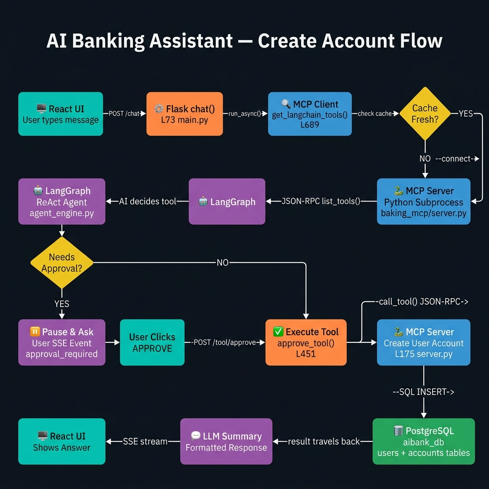

# AI Banking Assistant — How It All Works (Step by Step)

**The scenario we are tracing:**
> User types: `"Create an account for username: john123, password: pass456, initial deposit $500"`




Think of it like ordering food at a restaurant:
- **You (the user)** = the customer
- **React UI** = the waiter
- **Flask API** = the restaurant manager
- **LLM (AI)** = the chef deciding what to cook
- **MCP Server** = the kitchen actually cooking the food
- **PostgreSQL database** = the fridge where all the food/data is stored

Every `→` below means "this directly calls / leads to the next thing."

---

## STEP 0 — The App Starts Up (happens once, before anyone types anything)

```python
# FILE: main.py — Lines 32-37
#
# PROBLEM: Flask (our web server) is "synchronous" — it does one thing at a time.
#          But MCP and LangGraph need "async" code — they need to wait for
#          multiple things at the same time (like waiting for the AI to respond
#          while also keeping the database connection alive).
#
# SOLUTION: We create ONE permanent background thread that runs an async loop forever.
#           Think of it like hiring a dedicated assistant who handles all the 
#           "waiting" tasks so the main server doesn't have to stop and wait.
_shared_loop = asyncio.new_event_loop()
threading.Thread(target=_start_shared_loop, args=(_shared_loop,), daemon=True).start()

# FILE: main.py — Line 49
#
# We create ONE MCP Client for the whole app (not one per request).
# It remembers:
#   - Which MCP servers are configured (from mcp_config.json)
#   - Which servers are already running (so we don't start them twice)
#   - What tools each server has (cached so we don't ask every single time)
mcp_client = McpClient()
```

> **💡 Simple Note:** The MCP Client is like a phone book + speed dial.
> It knows the numbers (server configs), already called some of them (active sessions),
> and remembers what services they offer (tool cache).

---

## STEP 1 — User Types a Message, React Sends It to the Server

```js
// FILE: UI/src/api.js
//
// When the user clicks "Send", React opens a special streaming connection to our server.
// Instead of waiting for the FULL response, it reads the response bit by bit —
// that's what gives the "typing effect" in the chat.
//
// It sends:
//   message         → what the user typed
//   history         → all previous messages (so the AI remembers the conversation)
//   selected_servers → which banking tools to use ("banking-mcp")
//   source_documents → empty here because we're not doing document search

const response = await fetch("http://localhost:8000/chat", {
  method: "POST",
  body: JSON.stringify({
    message: "Create an account for username: john123, password: pass456, initial deposit $500",
    history: [],
    selected_servers: ["banking-mcp"],
    source_documents: []
  })
});
```

> **💡 Simple Note:** `fetch()` with streaming is like calling a radio station and
> hearing the show live — you don't wait for the whole recording, you hear it as
> it happens.

---

## STEP 2 — Flask Receives the Request and Prepares Everything

```python
# FILE: main.py — Line 72
#
# Flask is our web server. It receives the request from React.
# Before anything else, it does some housekeeping:

@app.route("/chat", methods=["POST"])
def chat():
    # First, throw away any old approval requests that are more than 2 minutes old.
    # Like clearing old orders from a restaurant table.
    approval_manager.cleanup_expired()

    # Read what the user sent
    user_input   = data.get("message")   # "Create an account for username: john123..."
    chat_history = data.get("history")   # [] — empty, this is the first message

    # If the user previously clicked "Deny" on a tool,
    # add a reminder note to the message so the AI doesn't suggest the same thing again.
    # (The AI forgets between requests, so we remind it manually.)
    if _last_denial:
        user_input += "\n\n[NOTE: User rejected this tool. Don't suggest it again.]"

    # Make absolutely sure "banking-mcp" is in the list.
    # Even if the user somehow didn't select it, we force it in.
    if "banking-mcp" not in selected_server_names:
        selected_server_names.append("banking-mcp")
```

**→ Now Flask needs to get the list of tools the AI can use. It calls:**

```python
    # FILE: main.py — Line 115
    #
    # run_async() is our bridge between Flask (sync) and the async world.
    # It says: "Hey background assistant thread, please run this for me and
    # give me back the result when it's done."
    # Flask waits here until all tools are returned.
    all_selected_tools = run_async(
        mcp_client.get_langchain_tools(filter_servers=["banking-mcp"])
    )
```

---

## STEP 3 → Tool Discovery (`mcp_client.py` Line 689)

```python
# FILE: mcp_client.py — Line 689
#
# This function's job: return a list of AI-ready "tool" objects.
# It asks: "What tools does banking-mcp have?"
# Then wraps each one in a LangChain package the AI can use.

async def get_langchain_tools(self, filter_servers=["banking-mcp"]):
    # Step 1: Get the raw list of tools from the server
    all_tools_data = await self.list_tools(target_servers=["banking-mcp"])

    # Step 2: Wrap each raw tool into a LangChain-compatible object
    lc_tools = []
    for tool in all_tools_data:
        server_name = tool.get("server")           # "banking-mcp"
        lc_tools.append(self._create_tool_wrapper(tool, server_name))

    return lc_tools  # Returns 6 ready-to-use AI tools
```

---

## STEP 4 → Checking the Tool Cache (`mcp_client.py` Line 386)

```python
# FILE: mcp_client.py — Line 386
#
# Before connecting to the server, check: do we ALREADY know what tools it has?
# We save the tool list for 5 minutes (300 seconds).
# Why? Because starting up the server just to ask "what tools do you have?"
# every single chat message would be very slow.

async def list_tools(self, target_servers=["banking-mcp"]):
    for server_name in ["banking-mcp"]:

        # Is there a saved tool list that's less than 5 minutes old?
        if server_name in self._tools_cache:
            cache_age = current_time - self._tools_cache[server_name]["timestamp"]
            if cache_age < 300:
                # YES — use the saved list, skip talking to the server
                all_tools.extend(self._tools_cache[server_name]["tools"])
                continue

        # NO cache (or it expired) — we need to actually talk to the server
        # First make sure the server is running
        session = await self.ensure_session(server_name)   # → see Step 5
        # Then ask it for the list of tools
        result = await session.list_tools()                # → JSON-RPC call
```

> **💡 Simple Note:** The cache is like checking your notes before calling a colleague.
> If you already wrote down what they told you 3 minutes ago, you don't call again.

---

## STEP 5 → Making Sure the MCP Server is Running (`mcp_client.py` Line 260)

```python
# FILE: mcp_client.py — Line 260
#
# Before we can talk to the banking server, it needs to be running.
# This function checks if it's already up, or starts it if not.

async def ensure_session(self, server_name="banking-mcp"):

    # Is there already a live connection? If yes, just return it immediately.
    if server_name in self.active_sessions:
        return self.active_sessions[server_name]   # Already running, done!

    # Not running yet. Use a "lock" so if two requests come at the same time,
    # only ONE of them starts the server (not two copies of the server).
    async with self._session_locks[server_name]:
        # Double-check inside the lock (maybe another request just started it)
        if server_name in self.active_sessions:
            return self.active_sessions[server_name]

        # Config tells us: run "python3 ./banking_mcp/server.py"
        server_config = {"name": "banking-mcp", "command": "python3", "args": ["./banking_mcp/server.py"]}

        # Start the server as a background task (non-blocking)
        asyncio.create_task(self._run_session_loop(server_config))

        # Wait here until the server signals it's ready (up to 300 seconds)
        await self.init_events[server_name].wait()

        return self.active_sessions[server_name]
```

> **💡 Simple Note:** Think of this like checking if the kitchen is open.
> If it's already open, walk in. If not, knock on the door and wait
> until someone opens it, then walk in.

---

## STEP 6 → Actually Launching the MCP Server As a Subprocess (`mcp_client.py` Line 208)

```python
# FILE: mcp_client.py — Line 208
#
# This is where the ACTUAL server process gets created.
# Our Python app literally runs "python3 ./banking_mcp/server.py" as a child process.
# It's like opening a second terminal window and running a command in it.
#
# The two processes (our app + the server) talk to each other through:
#   stdin  → we WRITE commands to the server (like typing into that terminal)
#   stdout → the server WRITES back answers (like reading what appears on screen)

async def _run_session_loop(self, server_config):
    params = StdioServerParameters(command="python3", args=["./banking_mcp/server.py"])

    async with auth_aware_stdio_client(params) as (read, write):
        # Three things run at the same time inside here:
        # 1. stdout_reader → watches for messages coming FROM the server
        # 2. stdin_writer  → sends our messages TO the server
        # 3. stderr_reader → watches for errors or login URLs from the server

        async with ClientSession(read, write) as session:
            # Send a "hello, are you ready?" message to the server
            await session.initialize()
            # Server replies "yes, I'm Banking-API, here's what I can do"
            # Handshake done. Connection is live.

            # Save this connection so other requests can reuse it
            self.active_sessions["banking-mcp"] = session

            # Signal that the server is ready (unblocks Step 5's wait)
            self.init_events["banking-mcp"].set()

            # Stay alive forever, holding the connection open for all future requests
            await asyncio.Event().wait()
```

> **💡 Simple Note:** Imagine you open a second terminal and run `python3 server.py`.
> Now you type JSON commands into that terminal and read the responses.
> That's EXACTLY what this code does — except it's automated.

---

## STEP 7 → What the MCP Server Does When It Starts (`banking_mcp/server.py`)

```python
# FILE: banking_mcp/server.py
#
# This is the BANKING SERVER — a completely separate Python program.
# It starts up, creates database tables if they don't exist, and then
# sits quietly waiting for commands through stdin.

init_db()
# → Connects to PostgreSQL and creates "users", "accounts", "transactions" tables
# → Uses SQLAlchemy (a library that talks to the database for us)

mcp = FastMCP("Banking-API")
# → FastMCP is a framework. It handles all the boring JSON-RPC protocol stuff.
# → You just write normal Python functions and FastMCP does the rest.

# The @mcp.tool() decorator does THREE things automatically:
# 1. Adds this function to a list of "available tools"
# 2. Reads the Python type hints (username: str, initial_deposit: float)
#    and generates a JSON description of the inputs — no manual work needed
# 3. Uses the docstring as the tool's description for the AI to read

@mcp.tool()
def create_user_account(username: str, password: str, account_number: str, initial_deposit: float = 0.0) -> str:
    """Create a new bank account for an existing or new user."""
    ...  # actual logic in Step 13

@mcp.tool()
def get_user_accounts(username: str, password: str) -> str:
    """Get all accounts for a user."""
    ...

# ... 4 more tools registered the same way ...

mcp.run(transport='stdio')
# → Now the server sits and listens on stdin forever.
# → When a command arrives (as JSON), FastMCP reads it, finds the right function,
#    calls it, and writes the result back to stdout.
```

**When our app calls `session.list_tools()`, the server responds with this:**
```json
{
  "tools": [
    {
      "name": "create_user_account",
      "description": "Create a new bank account for an existing or new user.",
      "inputSchema": {
        "type": "object",
        "properties": {
          "username":        { "type": "string" },
          "password":        { "type": "string" },
          "account_number":  { "type": "string" },
          "initial_deposit": { "type": "number", "default": 0.0 }
        },
        "required": ["username", "password", "account_number"]
      }
    }
  ]
}
```

> **💡 Simple Note:** This JSON is basically the server saying:
> "Here is a menu of what I can do. Each dish (tool) has a name,
> a description, and a list of required ingredients (inputs)."
> The AI reads this menu to know what actions are available.

---

## STEP 8 → Wrapping Each Tool So the AI Can Use It (`mcp_client.py` Line 553)

```python
# FILE: mcp_client.py — Line 553
#
# The raw tool info from the server is just JSON data.
# The AI (LangGraph) needs a real Python object it can call like a function.
# This step converts the JSON tool description into that Python object.

def _create_tool_wrapper(self, tool_def, server_name):
    name        = "create_user_account"
    description = "Create a new bank account..."

    # 8a. Schema Adapter
    # Sometimes tool schemas are complicated (nested objects, etc.)
    # The schema adapter SIMPLIFIES them so the AI can fill in the values easily.
    # For banking-mcp, schemas are already simple, so nothing changes here.
    llm_schema = schema_adapter.apply_llm_patches(name, original_schema)

    # 8b. Create a Pydantic Model (basically a strict form with field types)
    # This acts as a validator: if the AI passes "abc" for initial_deposit (a number field),
    # this will catch the error before it reaches the database.
    pydantic_model = create_model("create_user_account_input",
        username        = (str,            Field(...)),          # required
        password        = (str,            Field(...)),          # required
        account_number  = (str,            Field(...)),          # required
        initial_deposit = (Optional[float], Field(default=None)) # optional
    )

    # 8c. Safety Check — Does this tool CHANGE data?
    # Tools that create/delete/update data need human approval before running.
    # Read-only tools (like "get my balance") can run immediately.
    # "create" is in create_user_account → needs approval = True
    dangerous_words = ['create', 'delete', 'update', 'remove', 'modify', ...]
    requires_approval = any(word in name for word in dangerous_words)
    # → True  ← because "create" is in "create_user_account"

    # 8d. Two functions are created (like two doors):

    async def tool_func_raw(**kwargs):
        # DOOR 1 — The Real Action
        # This actually calls the MCP server and runs the tool.
        # Only reachable AFTER the user approves.
        cleaned = {k: v for k, v in kwargs.items() if v is not None}
        return await self.call_tool(server_name, name, cleaned)

    async def tool_func(**kwargs):
        # DOOR 2 — The Gatekeeper (this is what the AI calls first)
        # If the tool needs approval:
        #   → Save the action + all its arguments
        #   → Raise an exception to STOP the AI
        #   → Show the user a "Do you approve?" card
        # If NOT needs approval:
        #   → Just run it immediately (e.g., "check my balance")
        if requires_approval:
            approval = approval_manager.create_approval_request(...)
            raise ApprovalRequiredException(approval.to_dict())
        else:
            return await tool_func_raw(**kwargs)

    # Package everything into a LangChain StructuredTool that the AI can call by name
    return StructuredTool.from_function(
        coroutine=tool_func,         # AI calls this function
        name=name,                   # AI refers to it by this name
        description=description,     # AI reads this to know what it does
        args_schema=pydantic_model,  # AI fills in these fields
    )
```

> **💡 Simple Note:** Imagine you gave the AI a remote control.
> Each button on the remote is a "tool". Pressing a button (calling the tool)
> first goes through the gatekeeper — which checks:
> - "Is this a dangerous action?" → if yes, ask the human first
> - "Is this safe?" → run it immediately

---

## STEP 9 → The AI Picks Only the Tools It Needs (`main.py` Line 119)

```python
# FILE: main.py — Line 119
#
# We have 6 tools total. But we don't want to show the AI ALL 6 every time —
# that wastes tokens (= money) and can confuse the AI.
# So we make a QUICK, CHEAP AI call to ask: "Which tools do you need for THIS request?"

if len(all_selected_tools) > 3:
    # Send just the tool names + descriptions (not full schemas) to the LLM
    # Ask: "Given the user wants to 'create an account', which tools are relevant?"
    relevant_tool_names = run_async(
        mcp_client.select_relevant_tools(user_input, tools_for_selection, chat_history)
    )
    # AI replies: ["create_user_account"]

    # Keep only the relevant tool objects
    selected_tools = [t for t in all_selected_tools if t.name in relevant_tool_names]
    # → We now have just 1 tool to pass to the main agent
```

> **💡 Simple Note:** It's like giving a new employee only the relevant pages of the manual
> instead of the whole 500-page book. Less to read = faster and smarter decisions.

---

## STEP 10 → The AI Thinks and Decides What To Do (`agent_engine.py` Line 261)

```python
# FILE: agent_engine.py — Line 261
#
# NOW the main AI agent runs. This is the "brain" of the whole system.
# It uses a pattern called ReAct: Think → Act → Observe → Repeat.

# We build the agent with:
#   llm   → the AI model (e.g. GPT-4o-mini or local Ollama)
#   tools → [create_user_account] — the one relevant tool
#   prompt → instructions telling the AI HOW to behave as a banking assistant
runnable = create_react_agent(llm, tools=[create_user_account_tool], prompt=agent_system_prompt)

# The system prompt (the instructions) says things like:
#   "You are an AI banking assistant."
#   "ALWAYS use the MCP tools. Never make up data."
#   "If the user says 'create an account', use the create_user_account tool."
#   "Always ask for the password before calling any tool."
#   "Never refuse to accept a username or password from the user."

# The AI processes in a loop:
# 
#   THINK:   "The user wants an account. I have create_user_account. I should call it."
#   ACT:     Calls create_user_account with {username: "john123", password: "pass456", ...}
#   OBSERVE: Gets back the result (or an exception if approval needed)
#   REPEAT:  If the result means "done", give the final answer. Otherwise, think again.

async for event in runnable.astream_events({"messages": messages}, version="v2"):
    if kind == "on_chat_model_stream":
        yield {"type": "token", "content": chunk.content}   # stream text to UI

    elif kind == "on_tool_start":
        yield {"type": "tool_start", ...}                   # notify UI a tool is running

    elif kind == "on_tool_end":
        yield {"type": "tool_end", ...}                     # notify UI tool finished
```

**What happens next:** The AI calls `tool_func(username="john123", password="pass456", account_number="CHK-1004", initial_deposit=500.0)`

But remember the gatekeeper from Step 8? `"create"` is in the name, so:
- An `ApprovalRequiredException` is thrown
- The AI stops mid-execution
- The exception floats up to `agent_engine.py` Line 458

```python
except Exception as e:
    if hasattr(e, "approval_request"):
        # Package the approval info and send it to the UI
        yield {"type": "approval_required", "approval_request": e.approval_request}
```

> **💡 Simple Note:** The AI figured out WHAT to do and HOW to do it, but it
> can't actually press the button without your permission. So it stops and asks you.

> **What if the AI doesn't know the account number?**
> The system prompt says "Don't guess. Ask the user."
> So the AI replies: "Could you tell me the account number you'd like to use?"
> No tool is called. No approval is triggered. It just asks.

---

## STEP 11 → The UI Shows the "Approve?" Card (`main.py` Line 155)

```python
# FILE: main.py — Line 155
#
# Flask receives the "approval_required" event from the AI agent.
# It saves the full context (what the user asked, what the AI wants to do)
# and sends ONE final chunk to the React UI, then closes the stream.

if event["type"] == "approval_required":
    # Save everything about this pending action
    approval_manager.pending_approvals[approval_id].request_context = {
        "user_input": user_input,
        "chat_history": chat_history,
        ...
    }

    # Send this to the React UI and stop the stream
    yield f"data: {json.dumps({'type': 'approval_required', ...})}\n\n"
    return  # ← stream stops here. The AI is paused.
```

**React receives this.** It shows a card in the chat that says:
- 🔧 **Tool:** `create_user_account`
- 🏦 **Server:** `banking-mcp`
- 📋 **Arguments:** `{username: "john123", password: "pass456", account_number: "CHK-1004", initial_deposit: 500}`
- `[Approve]` `[Deny]`

The user reads it and clicks **"Approve"**.

React sends: `POST /tool/approve { approval_id: "some-uuid" }`

---

## STEP 12 → User Approved — Now Execute It! (`main.py` Line 451)

```python
# FILE: main.py — Line 451
#
# The user clicked Approve. Flask receives the approval_id and looks up
# the saved pending action. Then it runs the actual tool directly.

@app.route("/tool/approve", methods=["POST"])
def approve_tool():
    approval_id = data.get("approval_id")

    # Find the saved pending action by its ID
    approval_request = approval_manager.pending_approvals.get(approval_id)
    # If it's not found (maybe it expired after 2 minutes), return an error
    if not approval_request:
        return jsonify({"error": "Not found or expired"}), 404

    # Mark it as approved
    approval_request.decision = "approved"

    # Run the actual tool directly, skipping the approval gate
    # (We already have approval — we don't need to ask again)
    result = run_async(approval_request.tool_func(**kwargs))
    # This goes: tool_func_raw → call_tool → JSON-RPC → MCP server → database
```

---

## STEP 13 → The Tool Runs on the MCP Server and Hits the Database (`server.py` Line 175)

```python
# FILE: mcp_client.py — Line 471 (call_tool)
#
# This sends the actual command to the MCP server through the stdin pipe.
# The message is a JSON string that looks like:
# {"jsonrpc":"2.0","id":2,"method":"tools/call","params":{
#   "name": "create_user_account",
#   "arguments": {"username":"john123","password":"pass456","account_number":"CHK-1004","initial_deposit":500}
# }}
#
# The server's stdout_reader picks this up and hands it to FastMCP,
# which calls the create_user_account() function automatically.

async def call_tool(self, server_name, tool_name, arguments):
    session = await self.ensure_session(server_name)
    result  = await session.call_tool(tool_name, arguments)
    return result
```

**On the MCP server side, `create_user_account()` runs:**

```python
# FILE: banking_mcp/server.py — Line 175
#
# This is the actual banking logic. Real database operations happen here.

def create_user_account(username, password, account_number, initial_deposit=0.0):
    db = SessionLocal()   # Open a connection to the PostgreSQL database
    try:
        # 1. Does user "john123" already exist in the database?
        user = db.query(User).filter(User.username == "john123").first()

        if not user:
            # No → create them now
            # The password is hashed before storing (never store plain text passwords!)
            # Note: SHA256 is used here for simplicity. Production should use bcrypt.
            user = User(
                username="john123",
                password_hash=hashlib.sha256("pass456".encode()).hexdigest()
            )
            db.add(user)
            db.commit()      # Save the new user to the database
            db.refresh(user) # Read back the auto-generated user ID

        # 2. Is the account number "CHK-1004" already taken?
        existing = db.query(Account).filter(Account.account_number == "CHK-1004").first()
        if existing:
            return "Error: Account number 'CHK-1004' is already in use."

        # 3. Create the bank account with $500 balance
        new_account = Account(
            user_id=user.id,            # link to the user we just created
            account_number="CHK-1004",
            balance=500.0
        )
        db.add(new_account)
        db.commit()  # Save the account to the database

        return "Successfully created new account 'CHK-1004' for user 'john123' with initial balance $500.00."

    except Exception as e:
        db.rollback()  # If ANYTHING went wrong, undo all database changes
        return f"Error creating account: {str(e)}"
    finally:
        db.close()     # Always close the database connection when done
```

**The result string `"Successfully created..."` travels back:**
```
server.py stdout → stdout_reader (mcp_client.py) → read_stream → session.call_tool() → call_tool() → tool_func_raw → run_async → main.py:L486
```

---

## STEP 14 → Check If It Succeeded or Failed (`main.py` Line 492)

```python
# FILE: main.py — Line 492
#
# The result came back as a string. Was it a success or an error?
# We check two things:

# Check 1: Did the server return a JSON error? (MCP standard error format)
if result.startswith("{"):
    parsed = json.loads(result)
    if parsed.get("isError") is True:
        status = "error"

# Check 2: Does the string start with "Error"?
if "Error:" in result:
    status = "error"

# Our result is "Successfully created..." → no errors found → status = "success"
```

---

## STEP 15 → AI Writes a Nice Summary and Sends It Back to the User (`main.py` Line 531)

```python
# FILE: main.py — Line 531
#
# The raw result from the server is technical: "Successfully created new account 'CHK-1004'..."
# We want to show the user something nicer and more readable.
# So we make one MORE quick AI call — just to format the result beautifully.
#
# This AI call is very short and focused:
# "Here's what the tool did. Write a nice markdown summary."
# It doesn't need the full chat history — just the tool result.

prompt = "Summarize: Tool=create_user_account, Result=Successfully created account CHK-1004..."
final_answer = llm.invoke(prompt).content
# → "✅ Account **CHK-1004** has been created for **john123** with initial balance of **$500.00**."

# Remove this approval from memory (it's done, no longer needed)
del approval_manager.pending_approvals[approval_id]

# Send the final response back to React
return jsonify({
    "status":     "success",
    "answer":     final_answer,    # ← this is what appears in the chat bubble
    "result":     result,          # ← raw text (useful for debugging)
    "tool_calls": [...]            # ← shows which tools were used
})
```

**React receives this JSON, removes the approval card, and shows the final message in chat.** Done! ✅

---

## 🗺️ The Full Journey (Quick Reference)

```
User types a message
  → React sends it to Flask (POST /chat)
    → Flask grabs tools from MCP Client
      → MCP Client checks cache (5 min TTL)
        → Cache empty? → ensure_session()
          → Server not running? → start "python3 server.py" as a subprocess
            → Server boots → creates DB tables → registers 6 tools → listens on stdin
          → Send "initialize" handshake → server confirms → session is live
        → Ask server: "what tools do you have?" → get 6 tool descriptions back
        → Wrap each tool description into a Python function the AI can call
      → Quick AI call: "which 1-2 tools are relevant?" → ["create_user_account"]
    → Flask runs the LangGraph AI agent with just that 1 tool
      → AI reads: system instructions + user message + tool schema
      → AI decides: "I need to call create_user_account"
      → AI calls the tool → GATEKEEPER intercepts → Needs approval!
      → Raise exception → AI stops → send "approval_required" event to React
    → React shows Approve/Deny card to the user

User clicks "Approve"
  → React sends (POST /tool/approve)
    → Flask finds the saved pending action by ID
    → Flask calls tool_func_raw directly (skips the gatekeeper)
      → Sends JSON-RPC command to the MCP server via stdin pipe
        → Server receives it → runs create_user_account() → writes to PostgreSQL
          → Creates user row (john123 + hashed password)
          → Creates account row (CHK-1004, balance $500)
          → Returns success string
      → String comes back through stdout → parsed → returned to Flask
    → Flask makes a quick AI call to format the result nicely
    → Flask sends JSON response back to React

React shows the final message in chat ✅
```

---

## 📝 Key Concepts Summary

| Concept | What it actually is | Where in code |
|---|---|---|
| **MCP Server** | A separate Python process we start with `python3 server.py` | `mcp_client.py:L208` |
| **stdio transport** | Talking to the server by typing JSON into its stdin | `mcp_client.py:L48` |
| **Tool discovery** | Asking the server "what can you do?" via JSON-RPC | `mcp_client.py:L424` |
| **Tool wrapping** | Converting JSON descriptions into Python functions the AI can call | `mcp_client.py:L553` |
| **ReAct agent** | Think → Act → Observe loop the AI runs | `agent_engine.py:L353` |
| **Approval gate** | Checking if a tool is dangerous before allowing the AI to run it | `mcp_client.py:L654` |
| **SSE stream** | The "typing effect" — Flask sends response bit by bit to React | `main.py:L155` |
| **run_async** | The bridge that lets synchronous Flask talk to async AI code | `main.py:L39` |
| **Tool cache** | Saving tool descriptions for 5 min so we don't re-ask the server | `mcp_client.py:L409` |